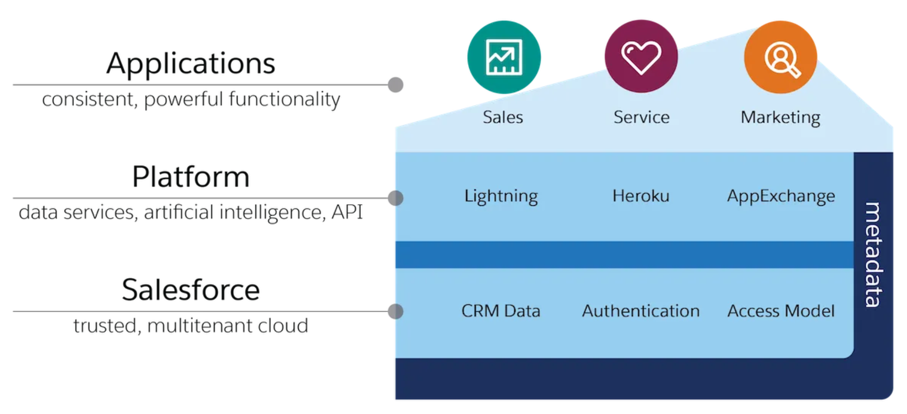

#### 1. What is Cloud Technology?
- A Cloud is an environment which is separate from your Local Machine.
- Its like having a Virtual Storage and Computing Space on the Internet where you can
	1. Store and Access your data
	2. Run your Applications
	3. Collaborate with others from any Machine.
_____
#### 2. What are the models of cloud?
Mainly there are 3 Models of Cloud:
1. Infrastructure as a Service (IAAS)
2. Platform as a Service (PAAS)
3. Software as a Service (SAAS)

| X               | IAAS                                                                             | PAAS                                                                                                                                                                                               | SAAS                                                                                                                                                                                                                        |
| --------------- | -------------------------------------------------------------------------------- | -------------------------------------------------------------------------------------------------------------------------------------------------------------------------------------------------- | --------------------------------------------------------------------------------------------------------------------------------------------------------------------------------------------------------------------------- |
| What you Get    | 1. Server 2. Storage 3. Networking                                       | You get a Complete Developement and Deployment Framework 1. Server 2. Storage 3. Networking 4. Operating System 5. Database 6. Security Tools 7. Programming Languages | A complete Software is Delivered to the Customer over the Internet on Subscription Basis. All the Underlying Infrastructure as well as the Applications and their Updates and Security are Managed by the Service Provider. |
| What you Manage | Underlying Systems 1. Operating System 2. Database 3. Security Tools | The Developers don't have to bother about the Underlying Infrastructure they can focus on their Application Development.                                                                           | Customer only needs to focus on his Business Processes that depend on  the Application.                                                                                                                                     |_____

_____
#### 3. Give Examples of each cloud model.

| IAAS                                                  | PAAS                         | SAAS                                                        |
|:----------------------------------------------------- |:--------------------------- |:---------------------------------------------------------- |
| 1. Amazon Web Services (AWS)   2. Microsoft Azure | 1. Force.com   2. Heroku | 1. Salesforce.com   2. Gmail   3. Google Word/ Sheet |

_____
#### 4. What is a Customer Relationship Management (CRM) tool?
- CRM is a software which helps us Manage Data about our Customers across the different steps of the Customer Life-cycle i.e. from Purchase to Service.
- A CRM also helps us to analyse the Data. Ex: Which Product is performing Well.
- A CRM also helps in Automating some Business Process.
_____
#### 5. Give Examples of  CRM.
- Salesforce
- Zoho
- Pipedrive
_____
#### 6. What is Salesforce?
- Salesforce is Company which has various products within its portfolio. Generally its know due to its Famous Salesforce CRM. But it also has other Products for ex:
  - Heroku : PAAS
  - Tableau : data visualization
  - Mulesoft : Integration tool
  - Slack : Business communication and collaboration tool. It supports integration with 3rd party tools to ease the collaboration of teams.
_____
#### 7. What are the Different clouds of Salesforce?
- Salesforce offers several different clouds, each designed to serve specific business needs and functions.
- A Salesforce Cloud is just an Application.

| Sales                                                                                                                                                                     | Service                                                                                                                   | Marketing                                                                                                                                                                                                                                                  | Community                                                                                                                                                                                                                                                                            |
| ------------------------------------------------------------------------------------------------------------------------------------------------------------------------- | ------------------------------------------------------------------------------------------------------------------------- | ---------------------------------------------------------------------------------------------------------------------------------------------------------------------------------------------------------------------------------------------------------- | ------------------------------------------------------------------------------------------------------------------------------------------------------------------------------------------------------------------------------------------------------------------------------------ |
| Sales Cloud provides  1. Lead Management 2. Opportunity Management 3. Contact and Account Management 4. Sales Collaboration 5. Reports and Dashboards | Service Cloud provides 1. Case Management 2. Knowledge Base : Articles and Documentation 3. Service Analytics | Marketing Cloud is a platform for creating and executing targeted marketing campaigns across multiple channels. It provides 1. Email Marketing 2. Social Media Marketing 3. Mobile Marketing 4. Advertising 5. Analytics and Reporting | Community Cloud allows organizations to create online communities (Forums) for their customers, partners, or employees. It provides 1. Community Setup 2. Collaboration 3. Self-Service Support : Articles 4. Employee Collaboration 5. Mobile-Ready Communities |

_____
#### 8. What are different Salesforce Editions?
All Salesforce editions share the look and feel, but the difference is
	1. Pricing
	2. Functionality
	3. Limitations (Governor Limits)

| Essentials                                                       | Professional                                                                                                                  | Enterprise                      | Unlimited                                                                                                                                                                                                                                                                                                                                   | Developer                                                                                                                                                                                             |
| ---------------------------------------------------------------- | ----------------------------------------------------------------------------------------------------------------------------- | ------------------------------- | ------------------------------------------------------------------------------------------------------------------------------------------------------------------------------------------------------------------------------------------------------------------------------------------------------------------------------------------- | ----------------------------------------------------------------------------------------------------------------------------------------------------------------------------------------------------- |
| 1. Designed for Small Business 2. Has Core CRM features  | 1. Small to Midsize Business needs. 2. Complete CRM features Admin+Development+Integration. 3. But Limited API access | Large and Complex Business  | It includes all the features of the Enterprise Edition, along with additional capabilities such as unlimited custom applications, 24/7 support, increased storage limits, and access to premium features like Salesforce Identity and Premier Success Services. It offers the highest level of customization, scalability, and flexibility. | 1. Free edition for Developers to test and Practice. 2. Cannot do Deployment to Production Envirnoment. 3. Has functionalities that are in Enterprise Edition only difference is Limitations. |

_____
#### 9. What is User Acceptance Testing (UAT)?
User Acceptance Testing (UAT) in Salesforce refers to the phase of testing where End Users (for whom the Org is made) tests the Salesforce solution to ensure it meets their requirements and is ready for deployment.
____
#### 10. Types of Salesforce Licences?
There are 4 types of Salesforce Licences
1. Org level Licence
   - When we purchase a Salesforce Edition it means we are purchasing an Org level Licence.
   - Setup &rarr; Quick Find box &rarr; Company Information &rarr; Organization Edition.
2. User Licence
   - Defines number of users and the functionality they can access in Salesforce Org.
   - Setup &rarr; Quick Find box &rarr; Company Information &rarr; User Licences.
3. Permission Set Licence : Permission set licenses let you offer more functionality to users in your org.
4. Add On Licences : These add-on licenses provide additional features, functionality, or access to specific Salesforce products or services.
**NOTE** : The added functionality provided by Permission Set Licence cannot go beyond the functionality of User Licence assigned to the particular User. Ex: If user has Force.com Licence you won't be able to assign him a Permission set that gives the user accessibility beyond what Force.com Licence allows.
_____
#### 11. What is Salesforce User Licence?
- A user license determines the baseline of features that the user can access. Every user must have exactly one user license.
- If a user has force.com-free licence then the user can only access functionality which is provided under that licence. You won't be able to provide more functionality by using permission set.
- Salesforce offers several types of user licenses to accommodate different user roles and access requirements.
  1. Salesforce License : Provides full access ex: Standard Objects, Custom Objects, Developer Console, etc. This is the complete licence.
  2. Salesforce Platform License : This license provides limited access to standard Salesforce features (Accounts and Contacts only, Chatter, Data import Wizard) but allows users to interact with and use specific custom applications built on the platform.
  3. Salesforce Community License : The Community license is for users who require access to Salesforce Communities. Communities are online portals that connect external users, such as customers, partners, or employees, with the organization. Users with this license can collaborate, access resources, and interact within the community.
_____
#### 12. Whats the difference between Lightning and Classic?
- Mostly observable difference is in the UI but there are also differences in some functionalities.
- Lightning offers a modern and visually appealing interface with a responsive design, while Classic has an Older or Traditional UI.
- New features and enhancements are introduced to Salesforce Lightning mainly so, it is recommended to transition to the new UI.
_____
#### 13. What is the release cycle of Salesforce?
Salesforce releases feature updates 3 times per year, and we identify releases by season—Winter, Spring, and Summer—along with the calendar year. Example: Summer ’23.
____
#### 14. What is the MVC model?
- MVC stands for Model View Controller.
- MVC is a a Software Design Pattern which divides the program logic into three interconnected elements.
	1. Model : Refers to our Salesforce Data Model i.e. Objects and their relationships.
	2. View : Refers to the User Interface i.e. Page Layouts, lwc, Visualforce Pages.
	3. Controller : Refers to the Business Logic (Programming Logic) i.e. Apex, Flows, Workflows, Approval Processes.
- Flow of MVC : 
	1. Controller accepts the Input from the Users via the User Interface.
	2. Then Controller process this input and passes to the Model and receives the Output.
	3. Then Controller takes this Output and Renders it to for the User using User Interface (UI).
**NOTE** : For some reason the definition of MVC is different provided by Salesforce (VF Page documentation page 1) than that of provided by the Wikipedia and rest of the Internet. So, I have used the definition given by Salesforce Documentation.
___
#### 15. What is Multi Tenancy?
A Multi Tenant environment has 2 Characteristics
1. Shared Resources : All user share the Same Resources i.e. CPU time, RAM, Servers.
2. Individual Instances : They are sharing the Resources but the Application has separate instance for each user so there core Data and Metadata will be owned by them only. In Salesforce each instance of the Salesforce CRM is called as an Organization (Org).
____
#### 16. Why use CRM?
1. **360 view** : It gives 360 degree view of the customer i.e. insight about all phases of customer life-cycle.
2. **Centralized Database**
3. **Collaboration** : As the Customers data is centralized different teams can collaborate easily.
4. **Automation** : CRM's provide automation's like sending mails, creating tasks so you no longer need to worry about forgetting things anymore.
5. **Modular and Customisable**
6. **Integration** with other Platforms ex: gmail.
7. avoid **Duplicate Data**
8. **Analysis** : CRM provides graphical view of your data so you can analyse the performance of your Products, Marketing Campaigns, Customer Retention and Customer Acquisition.
____
#### 17. What is Customer 360?
It simply means using multiple Salesforce products together to give your employees a single, shared view of every customer.
____
#### 18. Explain Salesforce's Architecture.
Salesforce is a Multi-tenant Platform.
- **Salesforce Platform: Salesforce Platform (force.com) is the foundation of all Salesforce Services**. It’s powered by metadata and made up of different parts, like data services, artificial intelligence, and APIs for development.  
- All Salesforce apps sit on top of the platform. Salesforce pre-built offerings like Sales Cloud and Marketing Cloud, along with apps you build using the platform sit on top of the Salesforce Platform. Everything is integrated.  
- **Metadata:** is data about data. All standard and custom configurations, functionality, and code in your org are metadata.

____
#### 19. What is API?
- The application programming interface (API) allows different pieces of software to connect to each other and exchange information.  
- When you add a custom object or field, the platform automatically creates an API name that serves as an access point between your org and the database. Salesforce uses that API name to retrieve the metadata and data you’re looking for. We can use a contact’s Name field in a bunch of places, like the Salesforce mobile app, a custom page, or even an email template. That’s all possible because of the API name. The core of the API’s power is that all of your data and metadata is API enabled.
___
## EXTRA
#### 1. What are the Phases involved in implementing and using the Salesforce platform?
1. Planning and Strategy: This phase involves understanding the business requirements, defining goals and objectives, and creating a roadmap for implementing Salesforce. It includes activities such as conducting a needs assessment, defining success criteria, and identifying key stakeholders.
2. Analysis and Design: In this phase, the business processes and requirements are analyzed in detail. Salesforce consultants or administrators work closely with stakeholders to gather requirements, map out processes, and design the Salesforce solution accordingly. This phase includes activities like data modeling, configuration, and customization.
3. Development and Configuration: In this phase, Salesforce is configured and customized to meet the specific needs of the organization. This may involve creating custom fields, objects, workflows, validation rules, and reports. It also includes integrating Salesforce with other systems if required.
4. Testing and Quality Assurance: Once the configuration and customization are complete, the solution undergoes rigorous testing to ensure it functions as expected. This includes unit testing, integration testing, and user acceptance testing (UAT) to validate the system against the defined requirements and scenarios.
5. Deployment and Training: Once the solution has passed testing and quality assurance, it is deployed to the production environment. This involves migrating data, setting up user access, and finalizing the system for use. Additionally, user training is conducted to ensure that users understand how to effectively use Salesforce for their roles and responsibilities.
6. Adoption and Optimization: After the initial deployment, the focus shifts to driving user adoption and continuously optimizing the Salesforce solution. This includes monitoring system usage, gathering feedback, addressing user concerns, and making enhancements based on evolving business needs.
7. Ongoing Support and Maintenance: Salesforce requires ongoing support and maintenance to ensure its smooth operation. This involves addressing user queries, troubleshooting issues, applying updates and patches, and managing security and data integrity.
___
#### 2. Why Cloud Computing is better than On Premise?
1. **Web Based:** As it is Web Based it can be accessed from anywhere.
2. **Lower Initial Costs:** As you don't have to buy a lot of hardware and you don't need a technical team to setup the Infrastructure and manage it you will be saving a lot.
3. **Scalability:** In Cloud Computing usually you pay as you go i.e. you only pay for the resources that you are using. So, anytime if you want to scale up or down your Business operations you can easily do so.
4. **Reliability:** Cloud computing makes data backup, disaster recovery, and business continuity easier and less expensive because data can be mirrored at multiple redundant sites on the cloud provider’s network.
5. **Better Security:** Every user is provided the same security.
6. **Free and Automatic Updates:** The Cloud providers keep their Hardware and Software updated so, you always get the latest and greatest in Tech.
7. **Better Productivity:** With Cloud Computing you don't have to worry about the IT Infrastructure, Maintenance, Security, Upgrades so, you can now focus better on your Business.
8. **Increased collaboration**
___